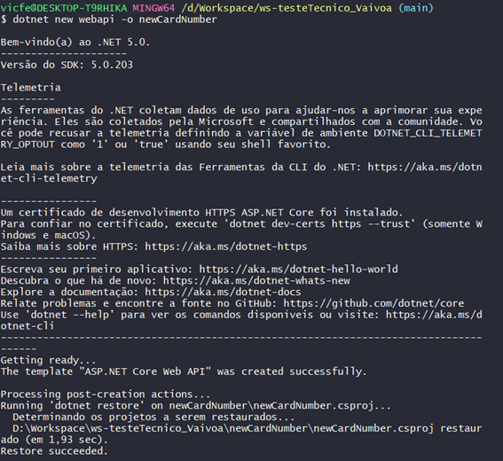

# **testeTecnico_Vaivoa**#
##Iniciei o desenvolvimento do projeto proposto como teste técnico criando a pasta onde estará todo o projeto da API em .NET, para isso inseri o comando dotnet new webapi -o newCardNumber no meu terminal:

