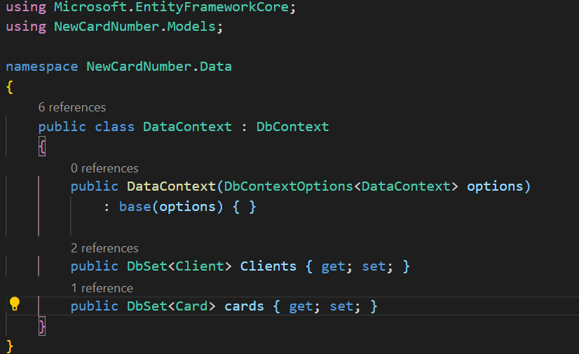

# TesteTecnico_Vaivoa
Iniciei o desenvolvimento do projeto proposto como teste técnico, criando a pasta onde estará todo o projeto da API em .NET, para isso inseri o comando dotnet new webapi -o newCardNumber no meu terminal:

Com a pasta ‘Template’ já criada, primeiramente fiz uma limpeza, tirei o conteúdo desnecessário para o meu projeto, que nesse caso foram os controladores MVC padrões e criei a pasta ‘Models’, onde vim a escrever as minhas entidades: Card.cs, Client.cs e NewCardNumber.cs

Em seguida, iniciei a implementação do Entity Framework Core, comecei estabelecendo que os banco de dados seriam armazenados em memoria:

Então estabeleci os tipos e tamanhos para cada componente das minhas entidades Client e Card:

Agora com as minhas entidades devidamente criadas precisava só criar um banco de dados para cada, primeiro criei a pasta Data em que criei o DataContext.cs, no meu DataContext.cs iniciei os banco de dados Clients e cards: 

Nesse momento, fui trabalhar com a lógica da criação do numero para um novo cartão, todo o processo ocorre na função CreateCardNumber() da classe NewCardNumberClass, essa função recebe como parâmetro um char representando a bandeira do cartão a ser gerado podendo ela ser Visa ou  Mastercard, esse é um parâmetro do tipo char que pode receber ‘v’ para Visa ou ‘m’ para Mastercard, trabalhei na função com um switch case, onde repito a lógica da criação do cartão dependendo sua bandeira. O numero de um cartão é divido em 3 partes a primeira é o prefixo que identifica a bandeira do cartão a seguir vem uma sequência de números que representa o dono do cartão, como um id para o mesmo, e por fim um caractere de segurança gerado com a utilização do algoritmo de Luhn, o qual funciona da seguinte forma: você multiplica os elementos em posições pares por 2 e os soma de forma que, se isso resultar em algum número com dois dígitos, você soma os dois, então soma o resultado aos elementos impares por fim é somar cada algarismo do seu atual resultado. Sendo assim, a função definira o prefixo com o uso das constantes definidas por mim MastercardPrefix e VisaPrefix, ira gerar o id aleatório com a função Random().Next()  e por fim aplicará a logica do algoritmo de Luhn

Por fim, escrevi os controller NewCardNumberController.cs, onde estabeleci dois métodos http sendo um Post para o registro de novos clientes com o seus emails e um Get para resgatar os cartões criados de forma que pode ser visto o email do dono de cada cartão e todos os cartões já gerados, o json do Post deve ser feito da forma apresentada a seguir:

